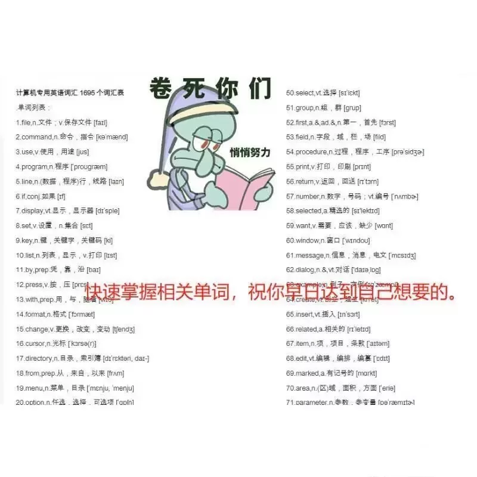
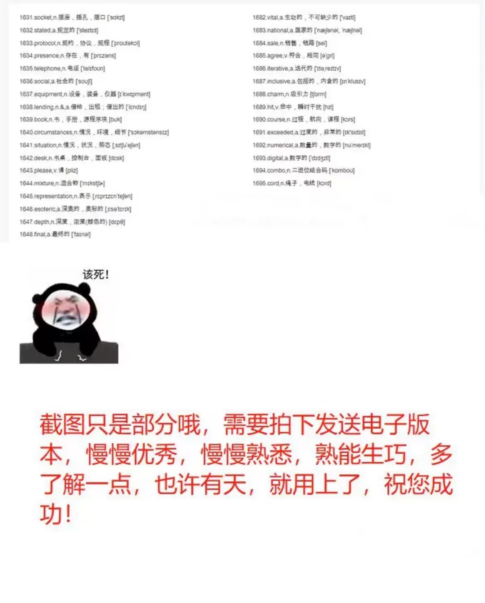
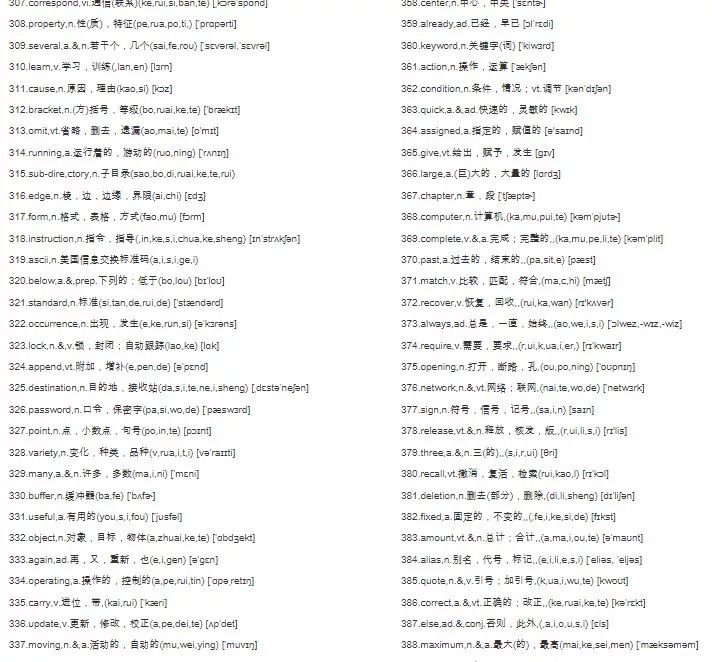
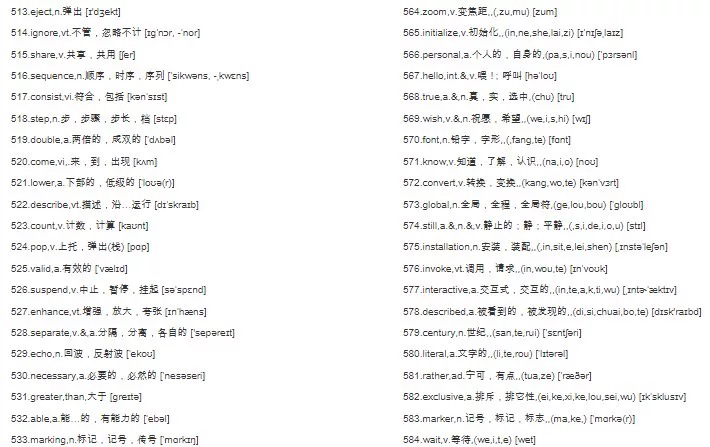
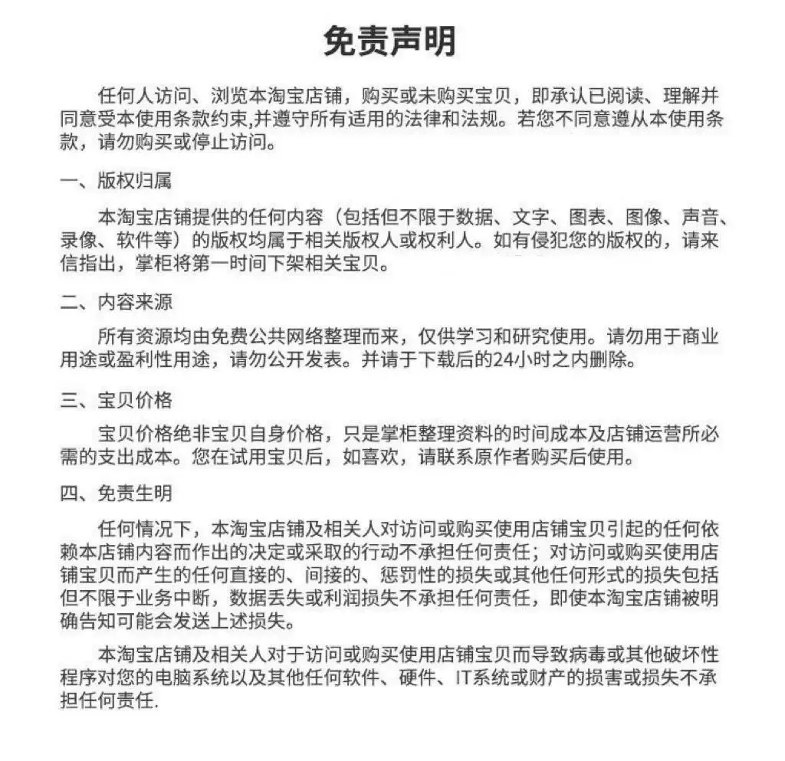
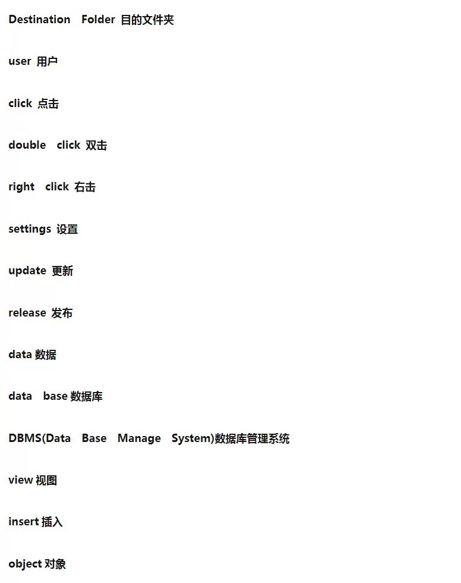
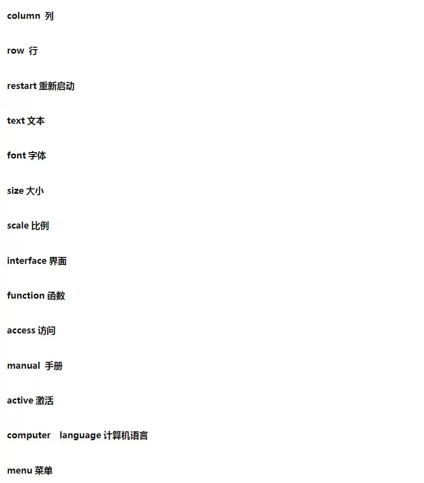
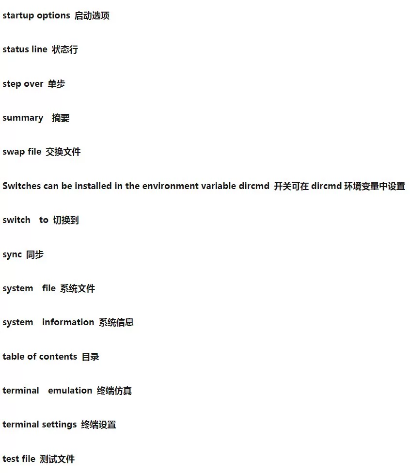

# Computer English Vocabulary - Professional Words, with Definition and Phonetic Markings 1600

## Body

1. Algorithm - A set of rules or procedures for solving a problem.
2. Data - Information that can be processed by a computer.
3. Computer - A device that processes data and performs calculations.
4. Programming - The process of writing code to control the behavior of a computer.
5. Database - A collection of data organized in a specific way.
6. Network - A group of computers connected together for communication.
7. Server - A computer that provides services to other computers.
8. Client - A computer that requests services from a server.
9. File - A collection of data stored on a computer.
10. Memory - The temporary storage of data used by a computer.
11. Hardware - The physical components of a computer, such as the CPU, RAM, and hard drive.
12. Software - The programs and applications used by a computer.
13. Operating system - The software that controls the hardware of a computer.
14. User interface - The part of a computer that allows users to interact with it.
15. Input - The data that is fed into a computer.
16. Output - The data that is displayed on a computer screen or printed out.
17. Storage - The permanent storage of data on a computer.
18. Processing - The operation of a computer to analyze and manipulate data.
19. Networking - The process of connecting computers together for communication.
20. Security - The protection of a computer system from unauthorized access.
21. Computation - The process of performing calculations using a computer.
22. Algorithmic complexity - The difficulty of a problem that can be solved using an algorithm.
23. Parallel processing - The use of multiple processors to perform tasks simultaneously.
24. Concurrency - The ability of multiple tasks to run concurrently on a single computer.
25. Multitasking - The ability of a computer to perform multiple tasks simultaneously.
26. Synchronization - The process of ensuring that multiple tasks are executed sequentially.
27. Communication - The exchange of information between two or more computers.
28. Distributed computing - The use of multiple computers to perform tasks simultaneously.
29. Parallel processing - The use of multiple processors to perform tasks simultaneously.
30. Concurrency - The ability of multiple tasks to run concurrently on a single computer.
31. Multitasking - The ability of a computer to perform multiple tasks simultaneously.
32. Synchronization - The process of ensuring that multiple tasks are executed sequentially.
33. Communication - The exchange of information between two or more computers.
34. Distributed computing - The use of multiple computers to perform tasks simultaneously.
35. Parallel processing - The use of multiple processors to perform tasks simultaneously.
36. Concurrency - The ability of multiple tasks to run concurrently on a single computer.
37. Multitasking - The ability of a computer to perform multiple tasks simultaneously.
38. Synchronization - The process of ensuring that multiple tasks are executed sequentially.
39. Communication - The exchange of information between two or more computers.
40. Distributed computing - The use of multiple computers to perform tasks simultaneously.
41. Parallel processing - The use of multiple processors to perform tasks simultaneously.
42. Concurrency - The ability of multiple tasks to run concurrently on a single computer.
43. Multitasking - The ability of a computer to perform multiple tasks simultaneously.
44. Synchronization - The process of ensuring that multiple tasks are executed sequentially.
45. Communication - The exchange of information between two or more computers.
46. Distributed computing - The use of multiple computers to perform tasks simultaneously.
47. Parallel processing - The use of multiple processors to perform tasks simultaneously.
48. Concurrency - The ability of multiple tasks to run concurrently on a single computer.
49. Multitasking - The ability of a computer to perform multiple tasks simultaneously.
50. Synchronization - The process of ensuring that multiple tasks are executed sequentially.
51. Communication - The exchange of information between two or more computers.
52. Distributed computing - The use of multiple computers to perform tasks simultaneously.
53. Parallel processing - The use of multiple processors to perform tasks simultaneously.
54. Concurrency - The ability of multiple tasks to run concurrently on a single computer.
55. Multitasking - The ability of a computer to perform multiple tasks simultaneously.
56. Synchronization - The process of ensuring that multiple tasks are executed sequentially.
57. Communication - The exchange of information between two or more computers.
58. Distributed computing - The use of multiple computers to perform tasks simultaneously.
59. Parallel processing - The use of multiple processors to perform tasks simultaneously.
60. Concurrency - The ability of multiple tasks to run concurrently on a single computer.
61. Multitasking - The ability of a computer to perform multiple tasks simultaneously.
62. Synchronization - The process of ensuring that multiple tasks are executed sequentially.
63. Communication - The exchange of information between two or more computers.
64. Distributed computing - The use of multiple computers to perform tasks simultaneously.
65. Parallel processing - The use of multiple processors to perform tasks simultaneously.
66. Concurrency - The ability of multiple tasks to run concurrently on a single computer.
67. Multitasking - The ability of a computer to perform multiple tasks simultaneously.
68. Synchronization - The process of ensuring that multiple tasks are executed sequentially.
69. Communication - The exchange of information between two or more computers.
70. Distributed computing - The use of multiple computers to perform tasks simultaneously.
71. Parallel processing - The use of multiple processors to perform tasks simultaneously.
72. Concurrency - The ability of multiple tasks to run concurrently on a single computer.
73. Multitasking - The ability of a computer to perform multiple tasks simultaneously.
74. Synchronization - The process of ensuring that multiple tasks are executed sequentially.
75. Communication - The exchange of information between two or more computers.
76. Distributed computing - The use of multiple computers to perform tasks simultaneously.
77. Parallel processing - The use of multiple processors to perform tasks simultaneously.
78. Concurrency - The ability of multiple tasks to run concurrently on a single computer.
79. Multitasking - The ability of a computer to perform multiple tasks simultaneously.
80. Synchronization - The process of ensuring that multiple tasks are executed sequentially.
81. Communication - The exchange of information between two or more computers.
82. Distributed computing - The use of multiple computers to perform tasks simultaneously.
83. Parallel processing - The use of multiple processors to perform tasks simultaneously.
84. Concurrency - The ability of multiple tasks to run concurrently on a single computer.
85. Multitasking - The ability of a computer to perform multiple tasks simultaneously.
86. Synchronization - The process of ensuring that multiple tasks are executed sequentially.
87. Communication - The exchange of information between two or more computers.
88. Distributed computing - The use of multiple computers to perform tasks simultaneously.
89. Parallel processing - The use of multiple processors to perform tasks simultaneously.
90. Concurrency - The ability of multiple tasks to run concurrently on a single computer.
91. Multitasking - The ability of a computer to perform multiple tasks simultaneously.
92. Synchronization - The process of ensuring that multiple tasks are executed sequentially.
93. Communication - The exchange of information between two or more computers.
94. Distributed computing - The use of multiple computers to perform tasks simultaneously.
95. Parallel processing - The use of multiple processors to perform tasks simultaneously.
96. Concurrency - The ability of multiple tasks to run concurrently on a single computer.
97. Multitasking - The ability of a computer to perform multiple tasks simultaneously.
98. Synchronization - The process of ensuring that multiple tasks are executed sequentially.
99. Communication - The exchange of information between two or more computers.
100. Distributed computing - The use of multiple computers to perform tasks simultaneously.
101. Parallel processing - The use of multiple processors to perform tasks simultaneously.
102. Concurrency - The ability of multiple tasks to run concurrently on a single computer.
103. Multitasking - The ability of a computer to perform multiple tasks simultaneously.
104. Synchronization - The process of ensuring that multiple tasks are executed sequentially.
105. Communication - The exchange of information between two or more computers.
106. Distribu

(Full product description was not available from the source page.)

## Images

## Payment

Here is a pay link on Stripe ( https://buy.stripe.com/3cs8yP7sY87d0vu9AB ). Please contact me lonlonago@foxmail.com after funding $89, and I will send you a complete data files , thank you!

